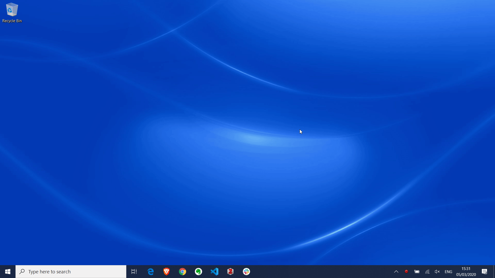
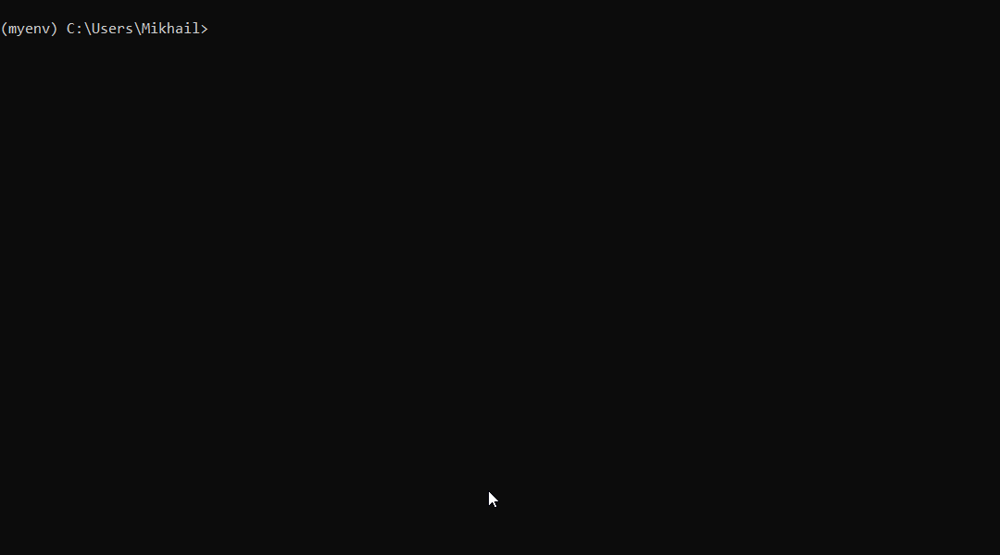

# Getting started with Anaconda

## Virtual environment

Let's open Anaconda Prompt \(or Command Prompt if you're Mac user\).



The first step is to choose the environment name. Usually, it's = project name.

```bash
conda create --name redcar python=3.7.4
```

After you have created a new virtual environment, you need to activate it to use it. To do so, use the following command:

```bash
conda activate redcar
```

Now you can install all the packages that you will use in this project. Let's try to install pandas:

```bash
conda install pandas
```

You can always install a specific version of a package `conda install pandas==0.25` \(e.g., your project group member using not the latest one.\) You can also install a set of packages at once. Just type them separated with space:

```bash
conda install matplotlib seaborn numpy
```

Let's take a look at what packages do we have:

```bash
conda list
```

To dump this list of packages into a single file use:

```bash
conda env export > environment.yml
```

🎉 We created a file conventionally called `environment.yml` that contains all the packages that have been installed! Now we can pass by this file to a person and he or she will be able to recreate the same setup. Usually this file is stored under `C:/Users/<your_user_name>/` \(and for Mac \)

Now let's get back to our base environment. For this simply type:

```bash
conda deactivate
```

Let's finalize our practice by deleting this virtual environment 😱 :

```bash
conda env remove --name redcar
```

Don't worry! We doing this only to recreate it again from previously environment.yml file 🦉 . If you somehow forget to do so, take one [here](https://github.com/mikhailsirenko/REDCAR/blob/master/.gitbook/assets/environment.yml) and put it to `C:/Users/<your_user_name>/` \(and for Mac \). The command for creating an environment from the file is as follows:

```bash
conda env create --name redcar --file environment.yml
```

Alright! We're back on track. We have a new **virtual environment** with a base set of packages to continue our work!


🧠 **Note:** There are other ways to manage virtual environments [pipenv](https://pipenv.pypa.io/en/latest/) or [venv](https://docs.python.org/3/library/venv.html). We cannot say which one is better. As usual there are pros and cons. Our advice is: whenever you feel uncomfortable with the tool that you're using, dive in to find a better option.



## Cookiecutter Data Science


[Cookiecutter](https://cookiecutter.readthedocs.io/en/1.7.0/README.html) is a tool that helps to create project templates for Python packages, Java and Android applications, etcetera. Having a project template with a couple of lines of code prevents you from manual work \(and that's the end goal, right 🐌?\).

The project template that we will use was designed by _DrivenData_ and called [Cookicutter Data Science](https://drivendata.github.io/cookiecutter-data-science/). The project website says: 

> _"Cookiecutter Data Science is a logical, reasonably standardized, but flexible project structure for doing and sharing data science work."_

After testing in numerous ⚔, we concluded that it's pretty handy. So let's continue by installing Cookiecutter and Cookiecutter Data Science.

The first step is to open Anaconda Prompt \(or Command Prompt\) and activate the virtual environment.

```bash
conda activate redcar
```

Now let's install Cookiecutter with pip \(it's not available with conda 🤷\):

```bash
pip install cookiecutter
```

Nice! The next step is to point Cookiecutter to a specific project template:

```bash
cookiecutter https://github.com/drivendata/cookiecutter-data-science
```

You'll get a set of questions such as: 

* project name and repo name \(usually they're =\), 
* author name \(surname and company if any\),
* short description of your project \(a couple of line of code for README.md\),
* licence \(read more about licenses [here](https://www.kiuwan.com/blog/comparison-popular-open-source-licenses/)\), 
* S3 bucket and AWS profile \(for establishing a pipeline with Makefile\).

Let's fill it up!




Alright! Great success! Now it's time to continue this work with Git and GitHub.



