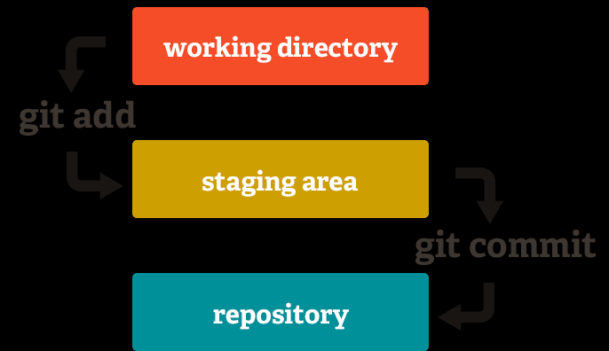

# Getting started with Git

## Git: the version control system

Open source software, developed by Linus Torvald, created to manage large open source project code.

## Prerequisites

* Your laptop
* Git installed \(installation instructions here : [https://git-scm.com/book/en/v2/Getting-Started-Installing-Git](https://git-scm.com/book/en/v2/Getting-Started-Installing-Git) - contains info for all platforms\)
* Anaconda

If you got lost during the workshop, here is an extended version of the Git Tutorial you can use later: [https://swcarpentry.github.io/git-novice/reference](https://swcarpentry.github.io/git-novice/reference)

## Launching the Command Line

The commands in these tutorials will utilize the command line because of its incredible flexibility and usability. We will also introduce visual interfaces to achieve some of the same actions later.

On Windows, you can either install GitBash or use the Anaconda Prompt. On macOS and Ubuntu the Terminal will work fine.

## Finishing Git setup

Git relies on your name and email address to identify who did what on the code. Let's set that up

```text
#(in command line interface - GitBash for Windows, Terminal for others)
$ git config --global user.name "the name that will be displayed"
$ git config --global user.email "email you used for your GitLab/GitHub account"
```

This name and email address will be associated to all "commits" \(bundle of changes\) applied to the code.

You may also be aware that different system encore characters differently. Let's adjust Git behavior to sort it out.

```text
#(in command line interface - GitBash for Windows, Terminal for others)
git config --global core.autocrlf input #for MACOS/Linux users
git config --global core.autocrlf true #for Windows users
```

## Your first Git repository

In any folder that does not already contain a Git repository

```text
$ git init
```

Check that the .git folder was created \(marker for Git repositories\)

```text
ls -a
```

Check the "status" of the repository \(the most useful Git command EVER\)

```text
$ git status
```

Start tracking the history of a file

```text
$ git add name_of_the_file_to_add
```

What did we add to what? Introduction to the staging area concept in Git



Save the changes operated on tracked files \(with a good message!\)

```text
$ git commit -m "Short, clear, and useful message about the changes"
```

Check changes you made with respect to the last "staged" changes \(for all touched files\)

```text
$ git diff
```

Check the past commits

```text
$ git log [no options | commit_id | file_name]
```

## Forgetting changes, recovering files, moving around the commit tree

Detaching the HEAD \(by mistake? on purpose? \)

```text
$ git checkout commit_id
```

```text
#Recover with:
$ git checkout branch_name (master by default)
#Restart "history" from here - start a new branch:
$ git checkout -b new_branch_name (do NOT call it "master")
```

Getting a single file back \(i.e. discard changes in the local file tree, recover the state of a given file at at given commit\)

```text
git checkout commit_id file_name
```

## Ignoring things - very useful

Create a ".gitignore" file in the root folder of your repository

```text
$ nano .gitignore #(rough, but should work in all environment)
```

The file contains a list of "filters" to check whether or not a change should be tracked by Git. Filter may tool like:

\(Ignoring all changes to files with the .temp extension, temporary checkpoints created by Jupyter Notebook or Lab, and all files in the "intermediate\_results" folder\)

```text
*.temp
.ipynb_checkpoints
intermediate_results/
```

## Collaboration - working with a remote

Objective: put the artefacts and their history in a location where it can be retrieved by others, and they can contribute to the project.

Step 1: Create the shared repository \(Git Lab - create empty repository; i.e. no readme file, just to make it easier to work\)

Step 2: link your local repository to the shared repository. The link is called an "upstream". The shared repository is where you will get the latest version from \(fetch\) and push your latests commits \(push\).

_This information is provided by GitLab when you create the shared repository! You get the repo URL from GitLab/GitHub_

```text
#command: git remote add [local_name] [URL_of_the_shared_repo]
#example:
$ git remote add origin https://github.com/vlad/planets.git

# check if it worked - list "remotes"
git remote -v
```

With this, the following commands will push and pull changes to and from the "remote":

```text
# command (get what's on the remote locally):
# git pull [name_of_the_remote_repository] [local_branch_to_store_commits]
# example:
$ git pull origin master

# command (send local changes to remote):
# git push [name_of_the_remote_repository] [remote_branch_to_store_commits]
# example:
$ git pull origin master
```

## Getting started with collaborating

Getting someone else's code: \(this is eased by GitLab/GitHub interface\)

```text
# command (copy remote repo locally):
# git clone [remote_url] [local_directory]
$ git clone https://github.com/vlad/planets.git ~/Desktop/vlad-planets
```

Note that "git clone" sets up the "remote" automatically

Work in groups, pick one of your repository, all members of the groups should have a local copy.

Everyone pull changes from the remote \(we are all on the same revision of the artefacts\)

Action 1: everyone touches a \_different\_ file. commit, push. Observe how nicely it runs.

Action 2: everyone touches the \_same file\_, observe push failure. Find out who "won" the commit race.

All those who could not "push", must pull. Check the content of the conflicting files

```text
Cold and dry, but everything is my favorite color
The two moons may be a problem for Wolfman
But the Mummy will appreciate the lack of humidity
<<<<<<< HEAD 
We added a different line in the other copy
=======
This line added to Wolfman's copy
>>>>>>> dabb4c8c450e8475aee9b14b4383acc99f42af1d
```

```text
<<<<<<< HEAD 
REMOTE REPOSITORY CONTENT OF THAT FILE, AT THAT POSITION
=======
LOCAL REPOSITORY CONTENT OF THAT FILE, AT THAT POSITION
>>>>>>> dabb4c8c450e8475aee9b14b4383acc99f42af1d
```

Remove the tags, edit the content so that it makes sense. Commit, push. Check if the others were faster than you!

## Notes:

### Documentation:

Leave a README file at the root of the repository. This file must contains a general description of the content of the repository. The README file indicates where the rest of the documentation is - or fully describes the project. Up to you!

Things to document:

* What is the project about
* Key technology used in the project \(programming language, tools used to compile/run\)
* Foldering structure \(what's what in here\)
* How to run, test, compile, execute content of the repository
  * commands to run the tool
  * where input/output files are located and what they contain
  * how to compile your thesis ! \(if you use Latex\)

### License:

The code you will be putting in GitLab / GitHub may be private or public. Your choice. If made public, and with the intent of sharing it with others \(regardless of who they are\), you MUST pick a license for your work.

In general, use an open license, allowing others to do what they want with your code. Worst license: no license \(basic copyright laws apply, and you can't find out what those are...\)

