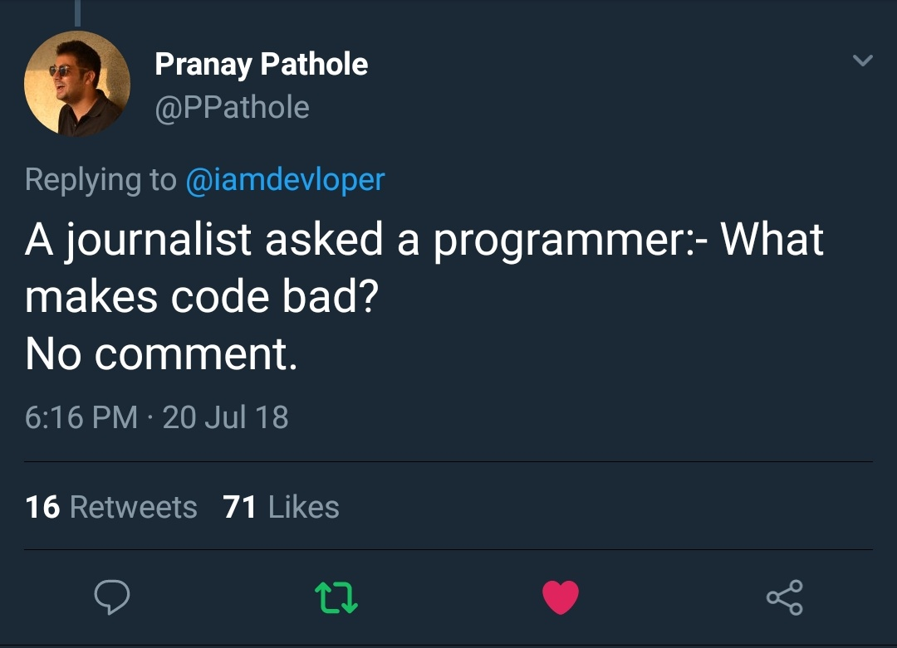

# Better code

I hope you are convinced that there is a need to write better code👨💻:


We talk about 3 interconnected things that matter:

1. Project structure;
2. Naming;
3. Comments.

## Data science project structure

The **project structure follows from** the chosen **workflow**. As we discussed in the previous section, there is no 🥇 standard, **workflows are similar** and **share the core**, to our knowledge the one proposed by the Hardvard's data science course is good-enough. So let's see what we have:


The process of asking the right question probably should not be documented as a script or a Jupyter Notebook. But starting from the second step, we will need some magic 🧞  Luckily we have a tool and template project structure that can easily satisfy this workflow needs. Ladies and gentlemen, welcome, [Cookiecutter](https://cookiecutter.readthedocs.io/en/1.7.0/README.html)!

_Cookiecutter_ is a tool that helps to create project templates for Python packages, Java and Android applications, etc. Having a project template created with a couple of lines of code prevents you from manual work \(and that's the end goal, right 🐌?\).

The project template that we will use was designed by _DrivenData_ and called [Cookicutter Data Science](https://drivendata.github.io/cookiecutter-data-science/). The project website says: 

> _"Cookiecutter Data Science is a logical, reasonably standardized, but flexible project structure for doing and sharing data science work."_

After testing in numerous ⚔, we concluded that it's pretty handy. The instructions on how to make it work can be found in [Getting started with Anaconda](../1-reproducible/1.1-get-started-anaconda.md). Let's take a closer look at its directory structure:

```text
├── LICENSE
├── Makefile           <- Makefile with commands like `make data` or `make train`
├── README.md          <- The top-level README for developers using this project.
├── data
│   ├── external       <- Data from third party sources.
│   ├── interim        <- Intermediate data that has been transformed.
│   ├── processed      <- The final, canonical data sets for modeling.
│   └── raw            <- The original, immutable data dump.
│
├── docs               <- A default Sphinx project; see sphinx-doc.org for details
│
├── models             <- Trained and serialized models, model predictions, or model summaries
│
├── notebooks          <- Jupyter notebooks. Naming convention is a number (for ordering),
│                         the creator's initials, and a short `-` delimited description, e.g.
│                         `1.0-jqp-initial-data-exploration`.
│
├── references         <- Data dictionaries, manuals, and all other explanatory materials.
│
├── reports            <- Generated analysis as HTML, PDF, LaTeX, etc.
│   └── figures        <- Generated graphics and figures to be used in reporting
│
├── requirements.txt   <- The requirements file for reproducing the analysis environment, e.g.
│                         generated with `pip freeze > requirements.txt`
│
├── setup.py           <- Make this project pip installable with `pip install -e`
├── src                <- Source code for use in this project.
│   ├── __init__.py    <- Makes src a Python module
│   │
│   ├── data           <- Scripts to download or generate data
│   │   └── make_dataset.py
│   │
│   ├── features       <- Scripts to turn raw data into features for modeling
│   │   └── build_features.py
│   │
│   ├── models         <- Scripts to train models and then use trained models to make
│   │   │                 predictions
│   │   ├── predict_model.py
│   │   └── train_model.py
│   │
│   └── visualization  <- Scripts to create exploratory and results oriented visualizations
│       └── visualize.py
│
└── tox.ini            <- tox file with settings for running tox; see tox.testrun.org
```

At first you can be feel overwhelmed with all new elements listed here: what is `tox.ini`, why do we need `Makefile`? Do not worry about it at first. Let's focus on the main folders.

### data

Data plays a critical role in reproducibility of a study. You manual fixed some typos, forgot original URLs where from the data was downloaded, overwritten raw data... Things like these make impossible to reuse your study. Besides, it is not really handy to run all of your notebooks again and again to download a single data set. If you found what you were looking for: write a downloading script and store it.


🐉**Warning**: Remember! Never manually correct raw data! If you did any manipulations to the data, separate it and store it in processed folder!


### notebooks

Computational **notebooks are for** sharing **stories** and important elements of your study 📖 . Do not use them for everything. If you wrote a function that does some preprocessing, make tests, comment it with a proper docstring and save it as \*.py file. The rule of thumb is do not put the code in the notebook if it is not necessary to either understand it or manipulate it \(i.e. some custom plot\).

As with any story, **computational notebooks** also **require an outline**. More more people are starting to use JupyterLab with an extension [Table of Contents](https://github.com/jupyterlab/jupyterlab-toc) \(if do not know, run and install it!\). However to make sure that everyone will be on board, put a bullet pointed list on top with an outline. See, everyone happy now 🌈 .

Finally, notebook should have a **clear purpose**, a **clear input** and **a clear output**. If I opened 1.1-data-gathering-cbs.ipynb, I'm expecting that the goal is to gather the data from CBS, the input is probably a URL, and the output is the data set saved elsewhere. If you are doing something complicated, It is pretty handy to have a diagram built in [Lucidchart](https://www.lucidchart.com), for example.

### src

src is a folder that contains source code for all sort of functions. Cookiecutter Data Science proposes a separation of functions by the goal. If it is a data gathering script, store it under data subfolder, etc. Straightforward logic, right? Again, after a certain time, you will start appreciate lengthy-function-free notebooks. Just give it some time and practice.

## Naming

## Comments

If we now we are \(thanks to project structure and correctly named notebooks\), there is no need in extensive commenting what you have done.

Commenting functions is essential! You need to use a certain docstring format for it. Take a look [here](https://www.datacamp.com/community/tutorials/docstrings-python#sixth-sub).



## Less ugly code in Jupyter Notebooks

Working with Python scripts can be clumsy in Jupyter Notebooks. You need you have either all scripts in the same folder as the notebooks or specify directory in a complicated fashion. That's pretty annoying.

As usual, there is a trick 🕵 ! You can install your project folder as package! Then process of importing your function will look like:

```python
from src.data import make_dataset
data_set()
```

Now, let's see how make it work. First, **we need** to have a file called **setup.py**. If you used Cookiecutter Data Science template, then the file was created by default. Here is an example this file's code:

```python
from setuptools import find_packages, setup

setup(
    name='src',
    packages=find_packages(),
    version='0.1.0',
    description='Modelig and simulation of Westeros weather',
    author='Jon Snow',
    license='BSD-3',
)

```

And second, we need to install it as a package. Remember, we need to do in a dedicated to the project virtual environment. Open Anaconda prompt and run the following lines of code:

```python
# Activate your virtual environment
conda activate redcar

# Go to the project directory
cd google drive/redcar

# Finally install the repo as a package
pip install --editable .
```

That it is! Amazing 🦄 !

