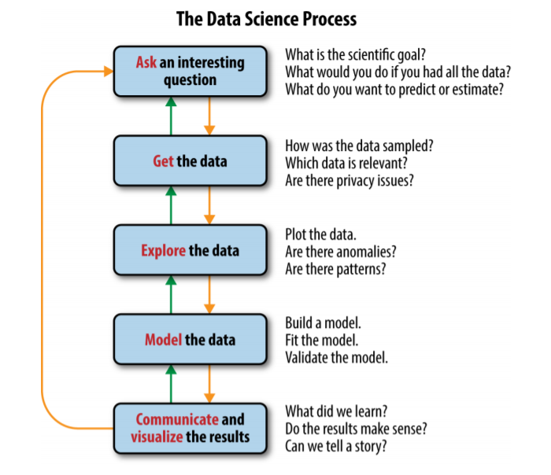

# Workshop 2: Understandable

### Introduction

The goals of the second workshop are:

* show you **how to organize your study** in a way that others \(fellow students, researchers or programmers\) can easily understand what an amazing job you did;
* remind you how efficiently **name variables**, **program functions** and why **code formatting** is important \(PEP-8, Black, ect.\); 
* practice it on a **case study**.

### Workflows

Let's talk about the workflows first. What is a _workflow_ in simple terms? Well, it's a flow of work 👨🎓, the **steps that you need to undertake to solve a problem or a task** in accordance with a domain \(i.e. data science, engineering\). A workflow can be a pretty extensive in tools that should be used to support each of the actions, or a more high-level \(so-called _step-wise_ approach\). Here is a formal definition by Business Process Management Center of Excellence Glossary \(Wikipedia contributors, 2020\):

> _"Workflow is an orchestrated and repeatable pattern of business activity enabled by the systematic organization of resources into processes that transform materials, provide services, or process information."_

Even though different domains require domain-specific knowledge to define a workflow and follow it, there are certain similarities across problem-oriented workflows. You start with a problem, do something in the middle and propose a solution or an insight at the end 👨🎓. Here is a great example:

Workflows are usually depicted with a diagram. Data science studies often depicted as directed acyclic graphs \(DAGs\), whereas in reality process looks similar to the system dynamics one \(going back and forth from one stage to another\).

Sounds obvious, of course, but it there are a couple of important implications to keep in mind. First, **qualitative** and **quantitative workflows have a similar skeleton**. Consider a step-wise approach proposed by Hermans & Cunningham \(2018\) and a workflow for data scientist by Ciara Byrne \(2017\):











Such a high-level similarity can be helpful in establishing a transdisciplinary collaboration and promotes joint understanding of the work process.

Second, it is important to **remember** that **you are addressing a problem** or a question \(and not the method\). Identification of the"right" problem is time consuming \(as well as finding an appropriate method\). Remember famous Russel Ackoff's saying?

> _"Successful problem solving requires finding the right solution to the right problem. We fail more often because we solve the wrong problem than because we get the wrong solution to the right problem."_

In case of a data science project it may seem trivial. The methods allow you predict, cluster, or try to explain a certain phenomenon. But when you start working, you can realize that there is a different angle that seems more promising. Just remember, violating from the original problem or doing research in an exploratory fashion, one hand problem, can bring unexpected benefits, but on the other side, can bring an extra burden and shift your deadlines.

Finally, students should remember that the **workflow ≠ thesis structure**. While it seems attractive to have a step of predefined steps, modeling process does not equal to scientific research process. Modeling serve to help answer research questions, propose solutions or evaluate policies. They are instruments of analysis.

### Better code

Project structure follows from the workflow

Naming

### Case study

### References

1. Wikipedia contributors. \(2020, March 23\). Workflow. In Wikipedia, The Free Encyclopedia. Retrieved March 23, 2020, from [https://en.wikipedia.org/w/index.php?title=Workflow&oldid=946935282](https://en.wikipedia.org/w/index.php?title=Workflow&oldid=946935282)
2. Hermans, L., & Cunningham, S. W. \(2018\). Actor and Strategy Models. Wiley Blackwell.
3. Ciara Byrne \(2017\). Development Workflows for Data Scientists. O’Reilly Media, Inc.
4. Richardson, G. P., & Pugh III, A. I. \(1981\). Introduction to system dynamics modeling with DYNAMO. Productivity Press Inc..

### Agenda

| When? | What? |
| :--- | :--- |
| 10:15 - 10:30 | Getting ready up with BBB |
| 10:30 - 10:45 | REDCAR project and workshop 2 introduction |
| 10:45 - 11:15 | Talking about workflows |
| 11:15 - 11:30 | Break |
| 11:30 - 12:00 | Who to write better code? |
| 12:00 - 13:00 | Starting with a case study |

