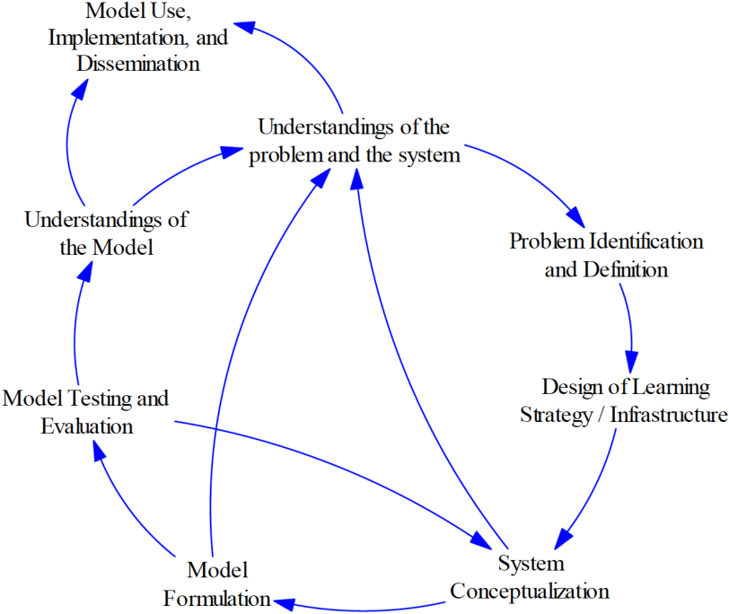

# Workflows

## Introduction

You decided to do a computational study. Great🔥! But **what kind of study**? The first **distinction** can be made between a **data science** project and **simulation study**. While having a similar skeleton \(as we discussed before\), there are essential differences such as setting up experiments, for example. There are other cool types of studies \(i.e. network analysis, bio-statistics\), but here we will focus only on those two.

‌Each of these types has its sub-types or methods. Ideally, the chosen method should fit the problem and the purpose. If you think that the problem is can be better described in System Dynamics than Agent-based Modeling, then go for System Dynamics. It would pretty weird to model bathtub dynamics with myriads of agents, right🙃? Recall [the law of the instrument](https://en.wikipedia.org/wiki/Law_of_the_instrument) and Abraham Maslow's quote:

> _"I suppose it is tempting, if the only tool you have is a hammer, to treat everything as if it were a nail."_

Let's assume that you have a clue which type of study to select. Now it is time to dive deeper! 

## Data science workflows

TL;DR Use [this](https://resources.github.com/downloads/development-workflows-data-scientists.pdf).

Important to clarify the **difference between data science** and **machine learning projects**. Typically, the result of a data science project is an insight into a certain phenomenon. For example, we want to see what characteristics make people buy milk or what The Hague's neighbourhoods have in common. Such a study sometimes called exploratory data analysis \(EDA\). Machine learning \(ML\) projects are different. Consider a following example: you pass an image to the algorithm\(-s\) and want to know whether it is a dog or a cat. There is less uncertainty related to the problem of the study. The side tasks of ML projects are to find the best algorithm and hyperparameters. To progress in EDA you may think about collecting extra data, applying different types of algorithms.

As a result machine learning workflows are a bit different from data science ones. Here the focus is on the latest one.

Currently, there is no 🥇 standard of data science workflow. Let's introduce the ones that found useful and discuss their differences. Here is a list: 

* [CRISP-DM](https://en.wikipedia.org/wiki/Cross-industry_standard_process_for_data_mining),
* [OSEMN](http://www.dataists.com/2010/09/a-taxonomy-of-data-science/) originally introduced by Mason & Wiggins and its slight modification [AOSEMN](https://datasciencemvp.com/articles/2019/04/16/aosemn/) by Clive, 
* the approach suggested by Geron in his bestseller [Hands-On Machine Learning with Scikit-Learn and TensorFlow](https://www.oreilly.com/library/view/hands-on-machine-learning/9781491962282/),
* and finally data science process from [the Harvard data science course](http://cs109.github.io/2015/) described by [Byrne \(2017\)](https://resources.github.com/downloads/development-workflows-data-scientists.pdf).

Apparently, they all have something in common😯. Let's compare them with old good table:

| **№** | \*\*\*\*[**CRISP-DM**](https://en.wikipedia.org/wiki/Cross-industry_standard_process_for_data_mining)\*\*\*\* | \([A](https://datasciencemvp.com/articles/2019/04/16/aosemn/)\)[**OSEMN**](http://www.dataists.com/2010/09/a-taxonomy-of-data-science/)\*\*\*\* |  ****[**Geron \(2017\)**](https://www.amazon.com/Hands-Machine-Learning-Scikit-Learn-TensorFlow/dp/1491962291)\*\*\*\* | [Byrne \(2017\)](https://resources.github.com/downloads/development-workflows-data-scientists.pdf). |
| :--- | :--- | :--- | :--- | :--- |
| 1 | Business understanding | \(Abstract\) | Frame the problem and look at the big picture | Ask an interesting question |
| 2 | Data understanding | Obtain | Get the data | Get the data |
| 3 | Data preparation | Scrub | Explore the data to gain insights | Explore the data |
| 4 | Modeling | Explore | Prepare the data to better expose the underlying data patterns with ML algorithms | Model the data |
| 5 | Evaluation | Models | Explore many different models and short-list the best ones | Communicate and visualize the result |
| 6 | Deployment | Interpret | Fine-tune your models and combine them into a great solution |  |
| 7 |  |  | Present your solution |  |
| 8 |  |  | Launch, monitor, and maintain your system |  |

Let's examine the table from top to the bottom. First, OSEMN is missing an essential component, that the rest have: a problem or a question. Clive proposed to call it an abstract and put it on top of OSEMN. 🎩 and you have AOSEMN. Alright, to be fair, the abstract is more than that. It also somehow resembles so-called [Readme Driven Development](https://tom.preston-werner.com/2010/08/23/readme-driven-development.html). Second, the bodies of the workflows seem pretty much similar. Only the bottom vary. CRISP-DM \(stands for the cross-industry standard process for data mining, by the way😉\) and Geron's approach have steps dedicated to deployment: step 6 and step 8, respectively. It is unlikely that as a student you will have a need to do that. No, of course, it is important, but a research typically ends with an answer to a research question.

To go deeper into what exactly each of the steps require, click on the links and read. If you are a beginner 👨🎓 we recommend you to look at Geron's book. It has nice examples and pretty extensive explanations. 


👨🏫 **Advice:** The workflows are pretty much the same 🎆 . By default use Harvard's one, but get familiar with the rest.


## Simulation studies workflows

Alright! Instead of conducting a data science project, you decided to conduct a simulation study. Understandable! You want to test different policies on, let's say, a supply chain. The next step is to select an appropriate _modeling paradigm_. Typically, the main ones are:   

Without a doubt, there are other important paradigms, but let's focus on these ones. Struggling with selecting? Take a look here at the work of Behdani \(2012\).

Kelton et al. \(2011\) proposed do differentiate the following steps in any simulation study:

1. Define high-level objectives and identify stakeholders. 
2. Define the functional specification, including detailed goals, model boundaries, level of detail, modeling approach, and output measures. Design the final report.
3. Build a prototype. Update steps 1 and 2 as necessary. 
4. Model or enhance a high-priority piece of the system. Document and verify it. Iterate. 
5. Collect and incorporate model input data. 
6. Verify and validate the model. Involve stakeholders. 
7. Return to step 4 as necessary. 
8. Design experiments. Make production runs. Involve stakeholders. Return to step 4 as necessary. Document the results and the model. 
9. Present the results and collect your kudos.

### Agent-based modeling

### System dynamics

### Discrete-event simulation

## References

1. Behdani B. Evaluation of paradigms for modeling supply chains as complex socio-technical systems. InProceedings of the 2012 Winter Simulation Conference \(WSC\) 2012 Dec 9 \(pp. 1-15\). IEEE.
2. Richardson GP, Pugh III AI. Introduction to system dynamics modeling with DYNAMO. Productivity Press Inc.; 1981 Jan 1.
3. Kelton, W. D., J. S. Smith, and D. T. Sturrock. 2011. Simio and Simulation: Modeling, Analysis, Applications. 2nd ed. New York: McGraw-Hill, Inc \(p. 17\).

