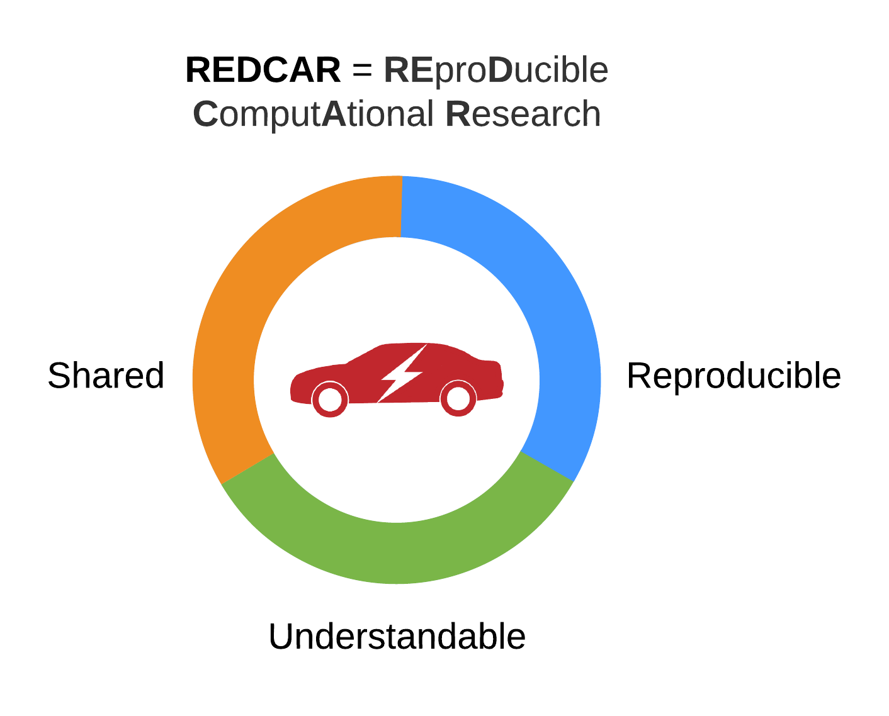

# Starting page

## Introduction

REproDucible ComputAtional Research or simply REDCAR is a project initiated by TU Delft [HumTechLab](https://www.tudelft.nl/tbm/over-de-faculteit/afdelingen/multi-actor-systems/research/humtech-lab/humtech-lab/). The goal of the project is to help students and researchers to make their computational results **reproducible**, more easily **understandable**, and **accessible to others**.

## Problem

Availability of new data, increased computational power and widespread of computational notebooks brought quantitative research to a whole new level. Now, using high-level programming languages such as Python scholars are able to perform an extensive analysis supervised with interactive plots.

Read more on challenges in reproducible research [here](https://www.nature.com/collections/prbfkwmwvz).

## Solution

To address these issues we linked three concepts into a system.

## Project

It consists of a series of 3 hands-on workshops and interactive tutorials that are stored here.

## To be prepared

To participate in the workshops you will need a laptop and a couple of tools installed. The preparation process will take less than 30 minutes.

1. Download and install Anaconda Distribution with Python 3.7 from [here](https://www.anaconda.com/distribution/). The process is pretty straightforward: select your operating system, download installer and follow the steps. If you already have it, make sure that it works by running any script in JupyterLab \(that's the IDE that we will work in\). If you prefer to use R programming language - no problem! After installing Anaconda Distribution, open it and install RStudio. To use R in Jupyter Notebook follow [this](https://docs.anaconda.com/anaconda/navigator/tutorials/r-lang/) simple tutorial. 
2. Install Git from [here](https://git-scm.com/downloads). The same principle works here: select your operating system and follow the steps.

That's it! All set now.

## License

[BSD-3-Clause](https://opensource.org/licenses/BSD-3-Clause)

## Acknowledgements

## References

